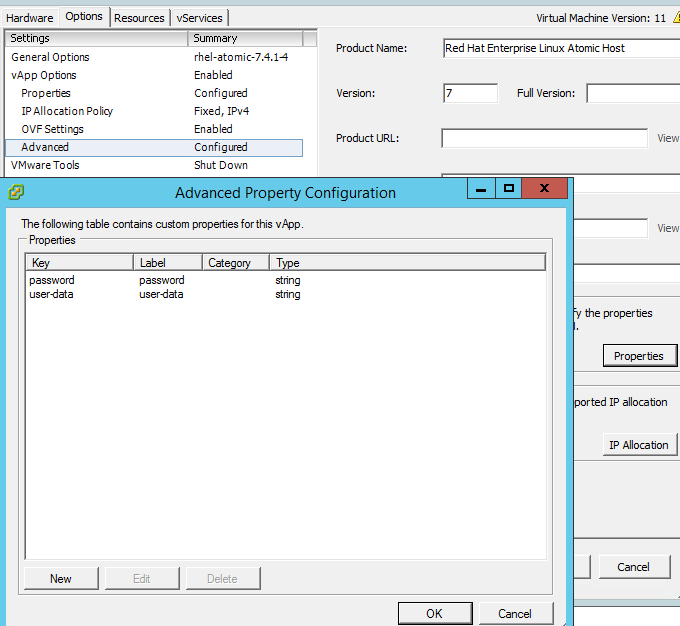
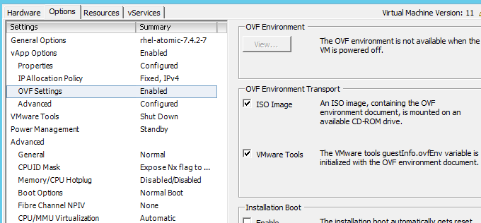
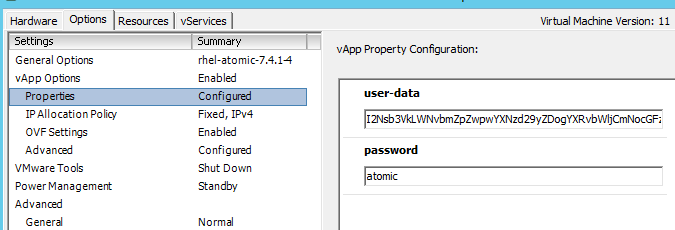

## Download

`https://access.redhat.com/site/downloads/content/271/`

# vSphere bootstrapping

We use the OVA based RH Atomic images, these images includes the vmware-tools which are needed to properly run operating system on vSphere.

The OVA images support injecting configuration using Ovfenv (example: <http://www.virtuallyghetto.com/2012/06/ovf-runtime-environment.html>). Currently we are not able to change these settings reliably using machinebuilder. Luckely the images are identified by vSphere as RHEL7, which allows us to bootstrap the OS using CustomizationSpecification on vSphere. The user configuration will be inserted in the template by hard configuring set Ovfenv with a minimal cloud-init string (we only use
this add users for post-deployment).

## Preparing the template

1. Download the OVA (https://access.redhat.com/site/downloads/content/271/)
2. Import into vSphere
3. Edit virtual machine setting and Options -> vApp Options -> Advanced -> Properties. And add user-data and password:

   
4. Enable ISO Image and VMware Tools Transport -> vApp Options -> OVF Settings

   
5. Edit virtual machine setting and Options -> vApp Options -> Properties. And add content for user-data as base64 string:

   
6. Edit virtual machine setting and remove NIC
7. Boot once, the only reason is to make vSphere aware of the guest OS and the vmware-tools
8. Change user-data to the default one (see above: simple or advanced)
9. Convert to template
10. Now we are ready to deploy RH Atomic and using customization specification to bootstrap and having the static cloudinit.
