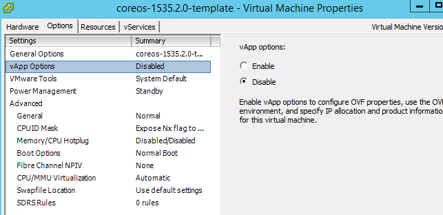

## Download

Stable

`curl -LO https://stable.release.core-os.net/amd64-usr/current/coreos_production_vmware_ova.ova`

Beta

`curl -LO https://beta.release.core-os.net/amd64-usr/current/coreos_production_vmware_ova.ova`

Alpha

`curl -LO https://alpha.release.core-os.net/amd64-usr/current/coreos_production_vmware_ova.ova`

# vSphere bootstrapping

Container Linux offers a vSphere bootstrapping by injecting the cloud-init config into VM parameters (vmx). This is described here: <https://coreos.com/os/docs/latest/vmware-guestinfo.html>

We can use this by preparing the OS template and using machinebuilder to add the cloud-init.

## Preparing the template

1. Download the OVA (<https://stable.release.core-os.net/amd64-usr/current/coreos_production_vmware_ova.ova)>
2. Import into vSphere
3. Edit virtual machine setting and Options -> vApp Options -> Disable
   
4. Edit virtual machine setting and remove NIC
5. Convert to template
6. Ready deploy to VM and adding cloudinit using `VirtualMachineConfigSpec.extraConfig`.

